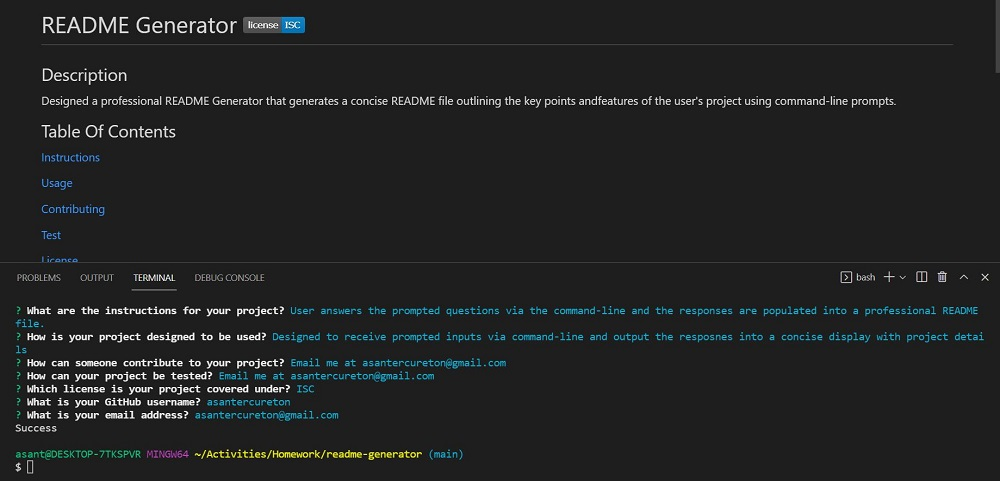

# readme-generator

## Name
README Generator

## Description
Designed a professional README Generator that generates a concise README file outlining the key points andfeatures of the user's project using command-line prompts.

## Links
[Source Code](https://github.com/asantercureton/readme-generator)

## Usage
Designed to receive prompted inputs via command-line and output the resposnes into a concise display with project details.

## Screenshots
Below is a screenshot of the project:

---
© 2021 Professional README Generator.